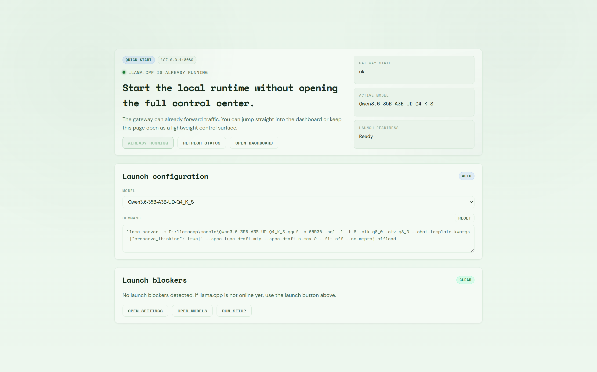
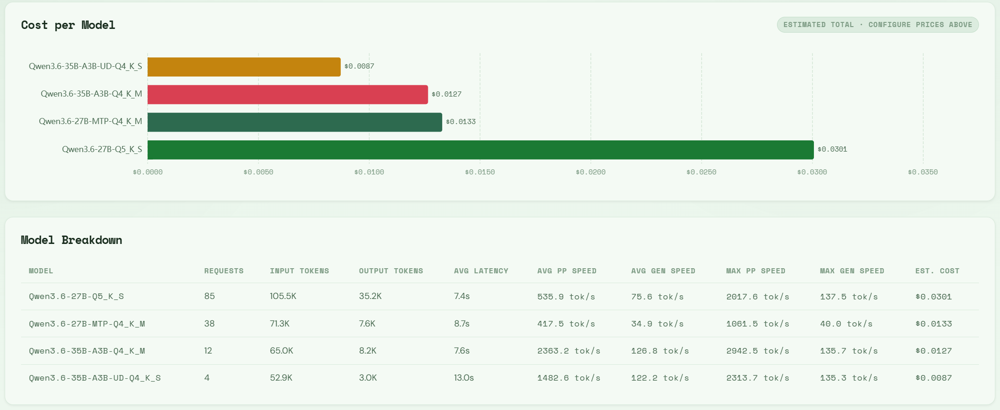
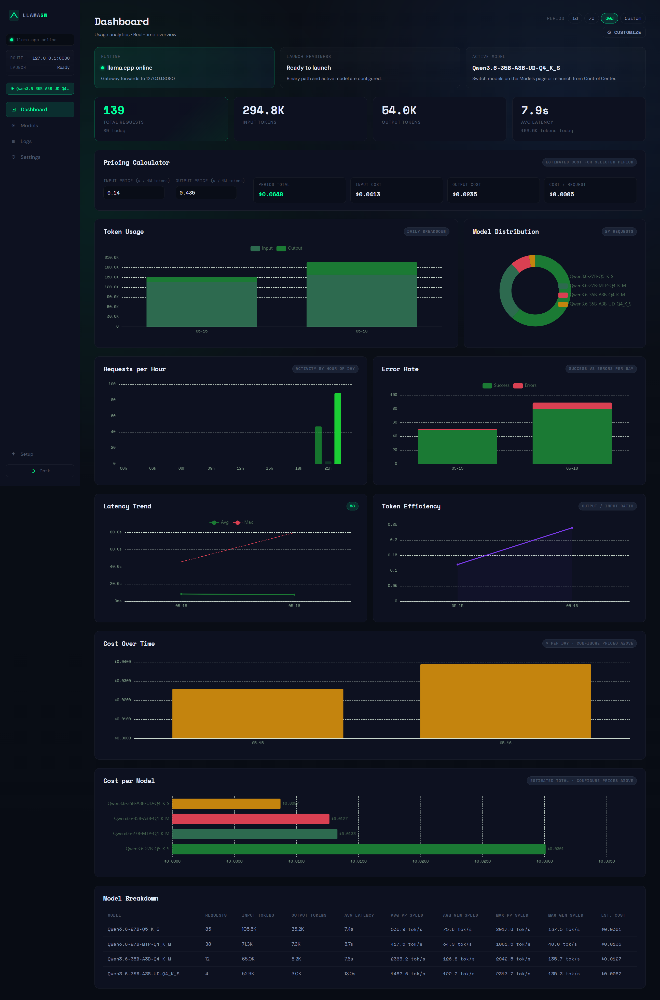
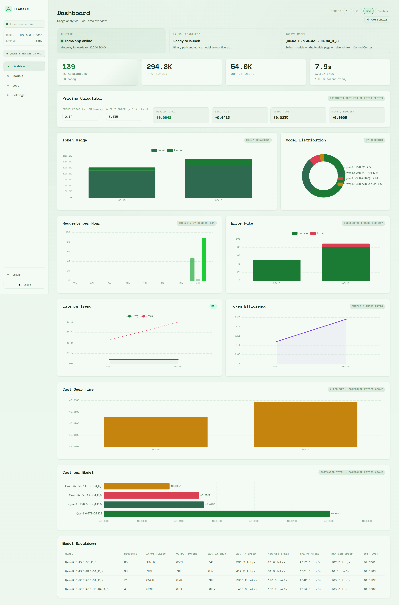
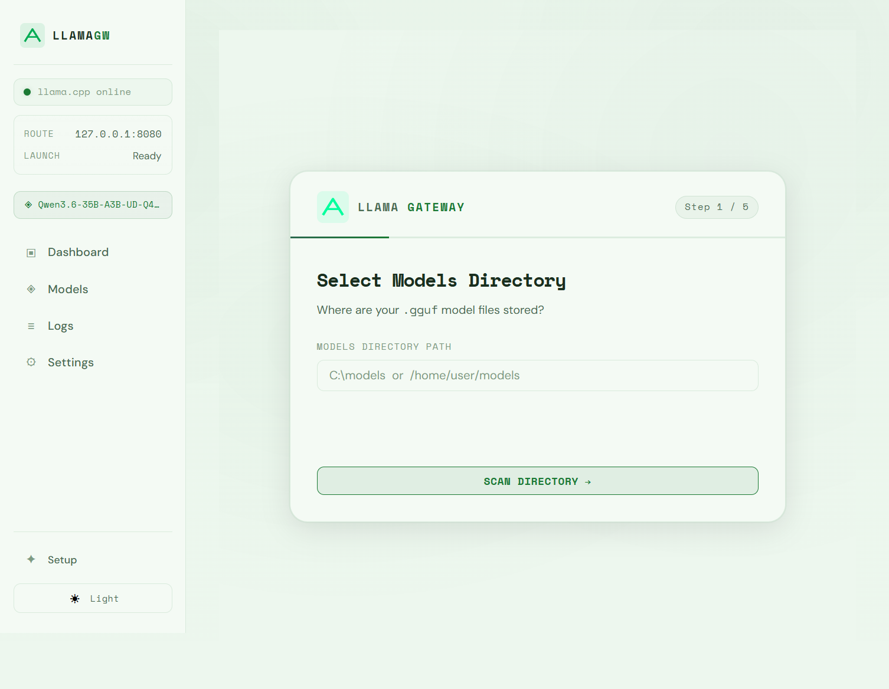
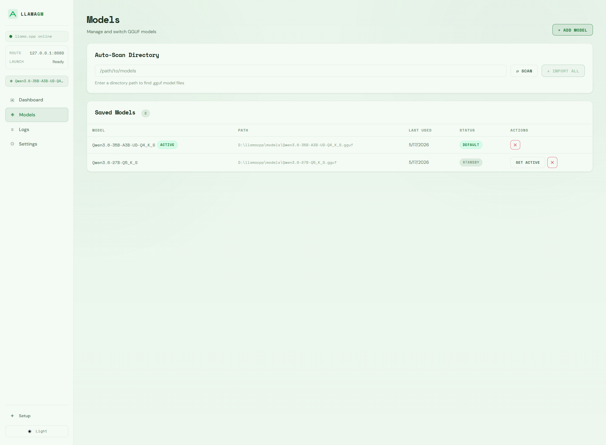
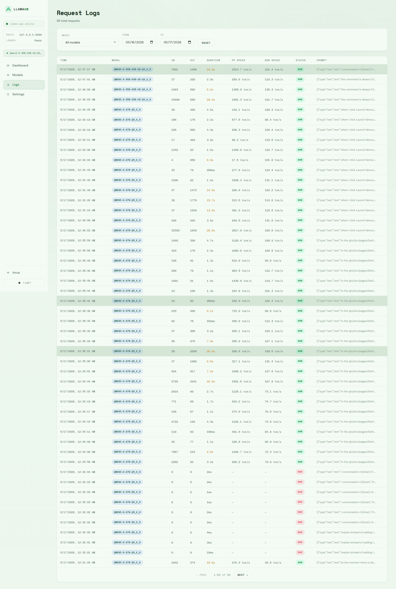
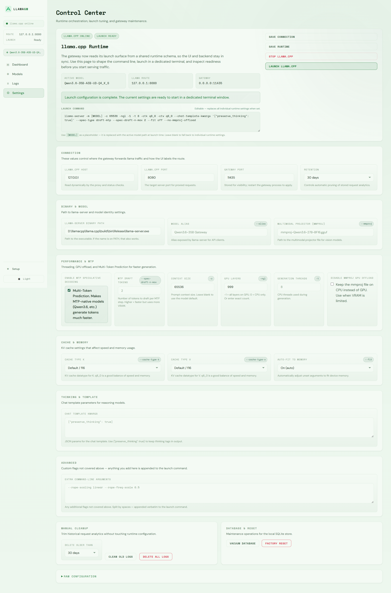

# Screenshots

This directory contains screenshots of the Llama Gateway UI across all pages and themes.

> **Note:** Every page shown here also has a dark mode variant. Unless otherwise noted, light mode is displayed by default.

## Screenshots

### Quick Start

A lightweight status view and single-click launcher for `llama-server` — no need to open the full dashboard.

---

### Dashboard — Model Breakdown

The Dashboard provides real-time analytics: total requests, tokens generated, latency trends, and per-model usage — giving you full visibility into your local LLM workload.

---

### Dashboard — Full View (Dark & Light)

Detailed views of the Dashboard in both themes, showing the complete analytics layout.

---

### Setup Wizard

The Setup Wizard walks you through first-run configuration: selecting the `llama-server` binary, scanning for `.gguf` models, and choosing an active model.

---

### Models

The Models page lets you scan directories for `.gguf` files, import them, set a default model, and manage the model catalog.

---

### Logs

The Logs page shows a paginated history of all requests passed through the gateway, including status codes, latency, and token counts.

---

### Settings

The Settings page provides full control over connection details, `llama-server` launch flags, sampling options, and maintenance actions like vacuum and reset.

